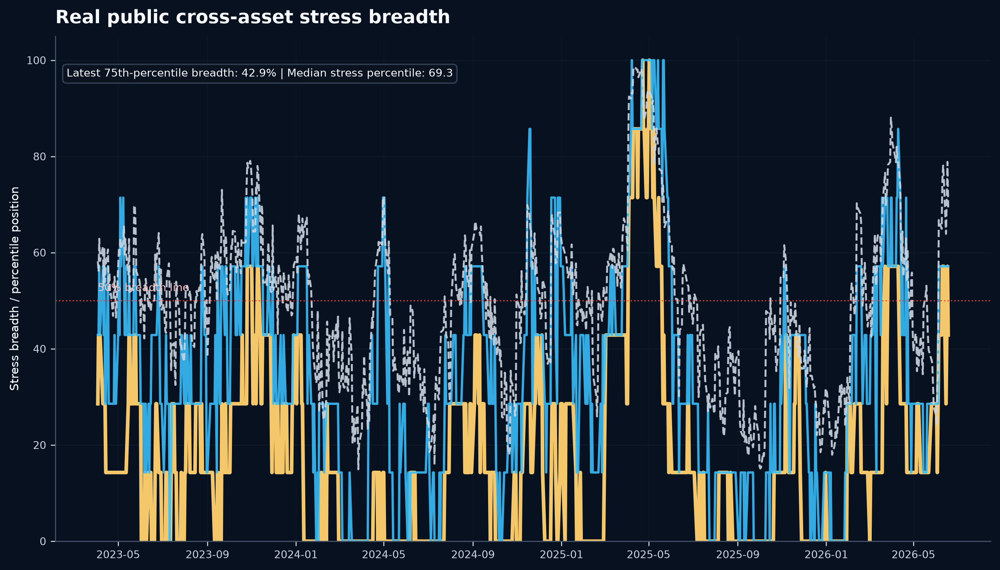
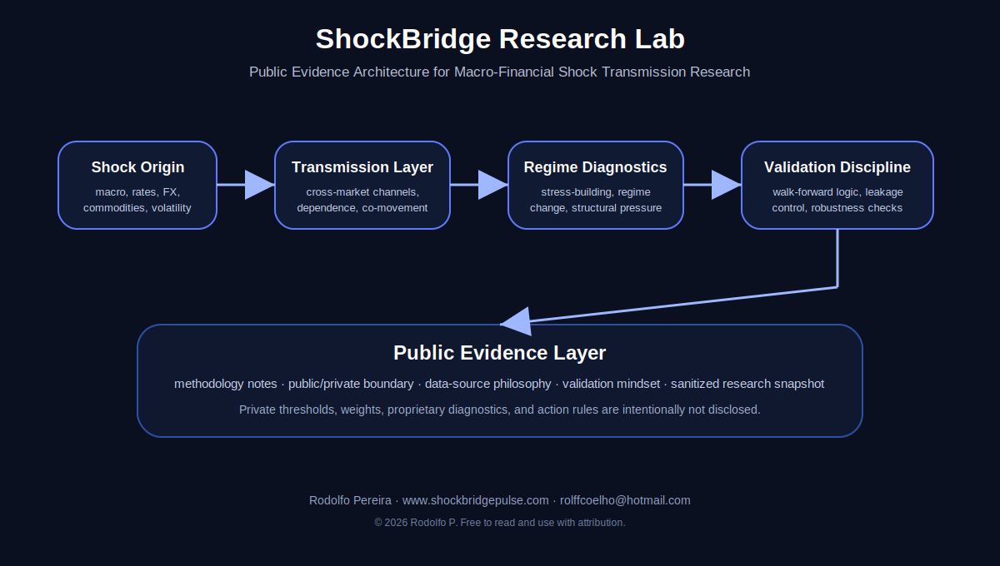

# ShockBridge Research Lab

<!-- SHOCKBRIDGE_REAL_DATA_FRONT_START -->

## Real-data public desk note

This repository is executable. The public pipeline generates a one-page research desk PDF from real public cross-asset market data.

**Core question:**  
**Is public cross-asset stress broadening or staying isolated?**



Run the full pipeline:

```bash
python examples/run_full_pipeline.py --open
```

Generated public outputs:

- `figures/public_cross_asset_stress_breadth.png`
- `reports/public_research_brief.md`
- `reports/ShockBridge_Public_Cross_Asset_Stress_Breadth_Desk_Note.pdf`

The chart shown above is generated by the same pipeline that builds the PDF. It uses real public market data across SPY, QQQ, TLT, GLD, USO, UUP, and HYG. It does not expose private thresholds, weights, diagnostics, or action rules.

<!-- SHOCKBRIDGE_REAL_DATA_FRONT_END -->


<!-- SHOCKBRIDGE_QUESTION_GRAPHIC_START -->


ShockBridge Research Lab is a macro-financial research project focused on how market stress travels across asset classes before it becomes obvious in headline data.

The project studies cross-market shock transmission using high-dimensional financial data, volatility regimes, multiblock dependence, macro confirmation layers, and research-desk interpretation.

## Research focus

I am a macro-financial researcher focused on high-dimensional financial and economic data, shock propagation, volatility regimes, and policy-relevant stress transmission. My work builds reproducible Python research pipelines to study how supply-side disruptions, market stress, derivatives signals, and cross-economy transmission channels affect growth, inflation, monetary policy, fiscal policy, and portfolio risk.

My research interests include financial econometrics, high-dimensional data, dynamic dependence, shock transmission, volatility modelling, derivatives overlays, macro-financial spillovers, and the structural features that amplify or buffer shocks across economies.

This lab is designed around one central question:

> How does a shock travel across systems before it is fully priced?

The research framework connects:

- cross-asset stress detection
- volatility and drawdown pressure
- multiblock dependence signals
- macro-financial confirmation layers
- commodity and gold stress anchors
- research-desk scenario interpretation

## Public/private boundary

This public repository is a sanitized evidence layer.

It does not include:

- proprietary thresholds
- private signal weights
- full model implementation
- internal validation logic
- hedge-action rules
- private research-desk decision logic
- raw proprietary workflow files

The private research engine is maintained separately.

## Current public research interpretation

The current private research stack identifies a market-led stress-building environment, while broad macro confirmation remains incomplete. This supports research review and scenario analysis rather than claiming a fully confirmed systemic regime.

## Methodological pillars

The private methodology combines:

- high-dimensional market panels
- rolling volatility and drawdown diagnostics
- multiblock dependence analysis
- MCCA-style bridge-pressure interpretation
- horizon-spread comparison between medium-horizon and structural synchronization
- macro confirmation using official macro series and a local cached LBMA AM gold benchmark
- walk-forward machine-learning validation

Only high-level methodology is described here. Exact rules remain private.

## Status

Public repository status: sanitized evidence layer.

Private methodology status: locked v4.3 macro + LBMA gold confirmation sidecar on top of the locked v4.1 market diagnostic.

<!-- SHOCKBRIDGE_PUBLIC_GRAPHIC_START -->

## Public research architecture

This repository presents the public evidence layer of ShockBridge Research Lab: a research framework for studying how stress propagates across macro-financial systems before it becomes obvious in headline data.

The figure below summarizes the public-facing logic of the project. It is intentionally conceptual and does not disclose private thresholds, weights, proprietary diagnostics, or action rules.



<!-- SHOCKBRIDGE_PUBLIC_GRAPHIC_END -->

<!-- SHOCKBRIDGE_PUBLIC_FOOTER_START -->

---

## Citation and attribution

If you use, reference, quote, adapt, or build from this public research evidence layer, please cite:

Pereira, R. (2026). *ShockBridge Research Lab: Public Evidence Layer for Macro-Financial Shock Transmission Research* [Computer software]. GitHub. https://github.com/rolffcoelho-bravo/shockbridge-research-lab

Author: Rodolfo Pereira  
Website: www.shockbridgepulse.com  
Email: rolffcoelho@hotmail.com  

© 2026 Rodolfo P. Free to read and use with attribution. Please cite the author and repository when referencing this work.

<!-- SHOCKBRIDGE_PUBLIC_FOOTER_END -->

